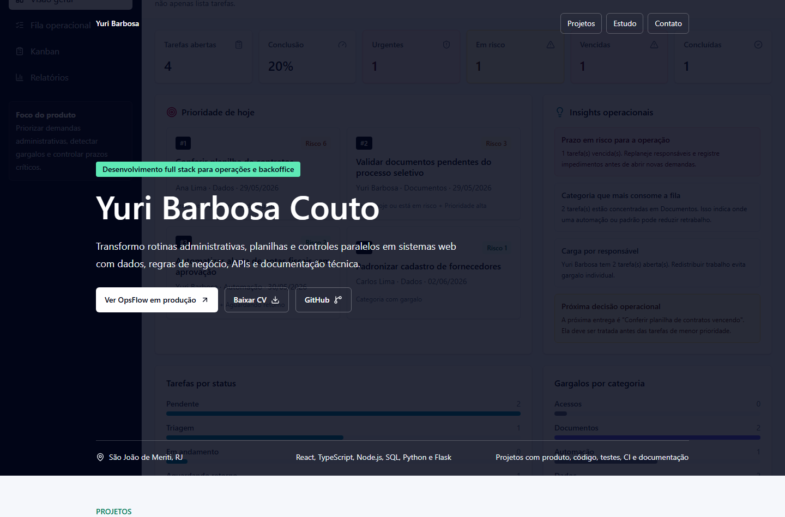
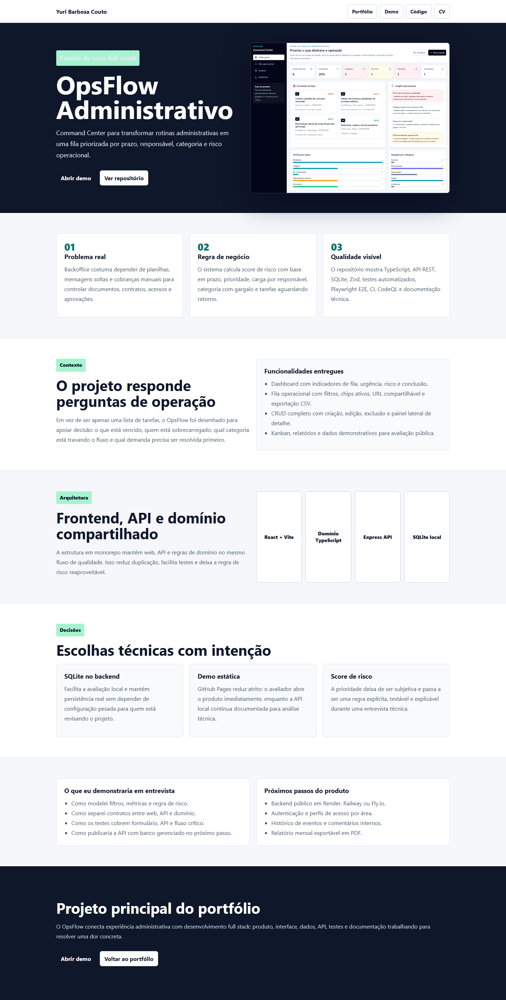

# Yuri Barbosa Couto | Portfolio

Portfolio curation layer: this site explains which projects are main work samples, which are technical labs, and which are experimental.


Professional portfolio for presenting full-stack projects, skills, CV, case studies, and the project maturity map.

[Demo online](https://yuribarbosacouto.github.io/yuri-dev-portfolio/) | [OpsFlow case](https://yuribarbosacouto.github.io/yuri-dev-portfolio/cases/opsflow.html) | [Repository](https://github.com/yuribarbosacouto/yuri-dev-portfolio)





## Purpose

The site positions Yuri Barbosa Couto as a full-stack developer in formation with focus on internal systems, operations, backoffice, dashboards, e-commerce UX, and automation.

It prioritizes a small, curated set of projects with public demos, clear maturity levels, case study context, hiring links, and technical documentation.

## Stack

- React 19
- TypeScript
- Vite
- Tailwind CSS
- Vitest and Testing Library
- GitHub Pages

## Run Locally

```bash
npm install
npm run dev
```

## Checks

```bash
npm run typecheck
npm run test
npm run build
```

## Quality

- CI with typecheck, tests, and build
- Automated GitHub Pages deploy
- CodeQL static analysis
- Dependabot for npm and GitHub Actions
- Dependency Review on pull requests

## Content

- Hero with professional positioning
- Link to CV PDF
- Main project shown as a case-study driven work sample
- Project map with maturity and repository connections
- Dedicated OpsFlow case study page
- Technical notes and learnings
- Technical skills
- Contact links

## Project Map

- OpsFlow Administrativo: main full-stack operations project
- Lume Fashion Commerce: product/UX and e-commerce project
- Yuri DB Lab: technical-depth systems/database lab
- PolyAgent Workbench: experimental simulated agent architecture workbench
- Portfolio: curation layer connecting the narrative

## Highlighted Projects

- OpsFlow Administrativo: https://github.com/yuribarbosacouto/opsflow-service-desk
- OpsFlow demo: https://yuribarbosacouto.github.io/opsflow-service-desk/
- OpsFlow case: https://yuribarbosacouto.github.io/yuri-dev-portfolio/cases/opsflow.html
- Lume Fashion Commerce: https://github.com/yuribarbosacouto/lume-fashion-commerce
- Lume demo: https://yuribarbosacouto.github.io/lume-fashion-commerce/
- Yuri DB Lab: https://github.com/yuribarbosacouto/yuri-db-lab
- PolyAgent Workbench: https://github.com/yuribarbosacouto/polyagent-workbench

## Artifacts

- CV source: [docs/CV.md](docs/CV.md)
- Public CV: [public/Yuri_Barbosa_Couto_CV.pdf](public/Yuri_Barbosa_Couto_CV.pdf)
- CV generation script: [scripts/build_cv_pdf.py](scripts/build_cv_pdf.py)
- Case screenshot: [docs/screenshots/portfolio-case-opsflow.png](docs/screenshots/portfolio-case-opsflow.png)
- Mobile case screenshot: [docs/screenshots/portfolio-case-opsflow-mobile.png](docs/screenshots/portfolio-case-opsflow-mobile.png)

## Changelog

See [CHANGELOG.md](CHANGELOG.md).
